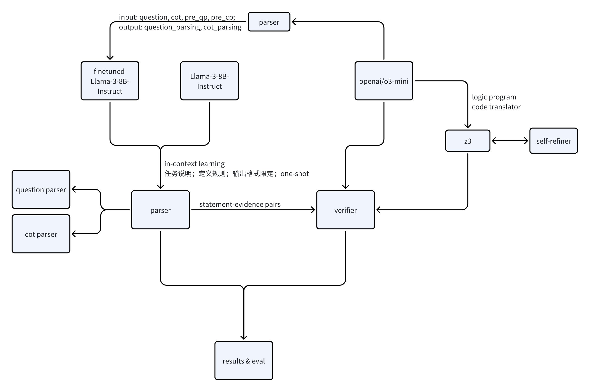

SRV: Empowering Self-Verification of Small Language Models through Step-wise Resoning and Verification

## Abstract

大语言模型展现了思考能力但是思考过程缺乏可解释性和可控制性。为了更详细地评估LLM的思考过程，本paper面向XLLM Workshop of ACL 2025的LLM for Structural Reasoning任务。深入研究LLM的逐步思考过程，提取每步思考论证和论点，验证每步思考的正确性，从而量化思考过程。我们的方法提出了两个组件：解析器和验证器。我们首先解析器对问题和思维链进行解析，提取出每个问题的所有条件，思维链的逐步思考，再用验证器对逐步思考加以验证。为了解析思考过程，我们用更强大的语言模型的少量数据来微调小模型；为了验证思考的正确性，我们还引入了确定性符号求解器对公式化的思考过程进行推理。我们在https://huggingface.co/datasets/shuyi-zsy/LLMSR/blob/main/llmsr/reference_Test_A.json的数据集进行测试，和基准相比，分别提高了xxx。~~此外，我们还发现了问题解析和思维链解析的差异，问题解析需要更确定性的答案，而思维链解析更发散。~~ (本paper的重点放在讨论思维链上）我们的研究结果表明，本paper的方法为细粒度分析逐步思考提供了一条有效的途径。

## Introduction

大型语言模型在自然语言处理领域取得了显著进展，但在需要精确逻辑推理的任务中（尤其是具有多个约束或子问题或需要专业知识的情况）仍面临挑战。传统的思维链方法虽然提高了模型的推理能力，但是思维链可能不可靠，导致下游推理表现不佳。最近的研究等表明大语言模型（OpenAI）可以自我纠正其回答并不断迭代直到产生适合的答案，这逐渐成为纠正不合适的生成的新的范式。但是能够自我纠正的模型都是参数量非常庞大的模型，需要大量的数据训练。https://arxiv.org/pdf/2404.17140等论文提出了 a novel pipeline to
generate self-correction data from a small LM,
and subsequently fine-tune the model to be a
self-correcting reasoner，并得到 The self-correction performance is largely bottlenecked by the verifier rather than the refiner.即小语言模型需要强验证器来提高self-correct reasoning。但是，该论文中的自我验证聚焦于整个思维链，没有对思维链进行精细化的验证。因此，本篇论文旨在通过采用少量数据，探索小型语言模型的更强大的自我验证机制。我们首先prompt Llama-3-8B-instruct生成logiqa问题的思维链，然后细粒度解析问题的每个条件，思维链的每个论证步骤，并加以验证。对于解析器，我们分别探索了规则设置prompt小型语言模型生成解析，和大型语言模型生成少量解析样本来微调小型语言模型；对于验证器，除了prompt大语言模型推理，我们还引入了确定性符号求解器，利用LLM将问题和推理步骤转化为符号公式，用符号求解器对公式化问题进行推理。
所有这些探索都旨在探索更细粒度更精确的自我验证器，来提高小型语言模型的自我纠正和推理能力，同时也为过程奖励建模提供更细粒度的奖励建模提供可能。
Framework:

## Methodology

### Parser

我们采用https://huggingface.co/datasets/shuyi-zsy/LLMSR/blob/main/llmsr/reference_Test_A.json的数据集完成我们的工做。
针对解析器，我们分别采用
这些验证结果能作为反馈来纠正模型的中间推理，或者提供更细粒度的奖励来辅助过程奖励建模。

用更强大的推理模型生成的少量输入来微调小模型，提高推理过程的准确度，成为可能。分析结果。

## References
@misc{zhang2024smalllanguagemodelsneed,
      title={Small Language Models Need Strong Verifiers to Self-Correct Reasoning}, 
      author={Yunxiang Zhang and Muhammad Khalifa and Lajanugen Logeswaran and Jaekyeom Kim and Moontae Lee and Honglak Lee and Lu Wang},
      year={2024},
      eprint={2404.17140},
      archivePrefix={arXiv},
      primaryClass={cs.CL},
      url={https://arxiv.org/abs/2404.17140}, 
}

@misc{paul2024refinerreasoningfeedbackintermediate,
      title={REFINER: Reasoning Feedback on Intermediate Representations}, 
      author={Debjit Paul and Mete Ismayilzada and Maxime Peyrard and Beatriz Borges and Antoine Bosselut and Robert West and Boi Faltings},
      year={2024},
      eprint={2304.01904},
      archivePrefix={arXiv},
      primaryClass={cs.CL},
      url={https://arxiv.org/abs/2304.01904}, 
}

@misc{pan2023logiclmempoweringlargelanguage,
      title={Logic-LM: Empowering Large Language Models with Symbolic Solvers for Faithful Logical Reasoning}, 
      author={Liangming Pan and Alon Albalak and Xinyi Wang and William Yang Wang},
      year={2023},
      eprint={2305.12295},
      archivePrefix={arXiv},
      primaryClass={cs.CL},
      url={https://arxiv.org/abs/2305.12295}, 
}