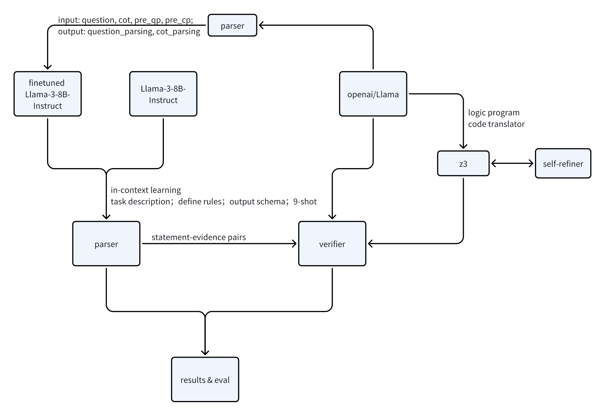

SRV: Empowering Self-Verification of Small Language Models through Step-wise Resoning and Verification

## Abstract

大语言模型展现了思考能力但是思考过程缺乏可解释性和可控制性。为了更详细地评估LLM的思考过程，本paper面向XLLM Workshop of ACL 2025的LLM for Structural Reasoning任务。深入研究LLM的逐步思考过程，提取每步思考论证和论点，验证每步思考的正确性，从而量化思考过程。我们的方法提出了两个组件：解析器和验证器。我们首先解析器对问题和思维链进行解析，提取出每个问题的所有条件，思维链的逐步思考，再用验证器对逐步思考加以验证。为了解析思考过程，我们用更强大的语言模型的少量数据来微调小模型；为了验证思考的正确性，我们还引入了确定性符号求解器对公式化的思考过程进行推理。我们在https://huggingface.co/datasets/shuyi-zsy/LLMSR/blob/main/llmsr/reference_Test_A.json的数据集进行测试，和基准相比，分别提高了xxx。~~此外，我们还发现了问题解析和思维链解析的差异，问题解析需要更确定性的答案，而思维链解析更发散。~~ (本paper的重点放在讨论思维链上）我们的研究结果表明，本paper的方法为细粒度分析逐步思考提供了一条有效的途径。

## Introduction

大型语言模型在自然语言处理领域取得了显著进展，但在需要精确逻辑推理的任务中（尤其是具有多个约束或子问题或需要专业知识的情况）仍面临挑战。传统的思维链方法虽然提高了模型的推理能力，但是思维链可能不可靠，导致下游推理表现不佳。最近的研究等表明大语言模型（OpenAI）可以自我纠正其回答并不断迭代直到产生适合的答案，这逐渐成为纠正不合适的生成的新的范式。但是能够自我纠正的模型都是参数量非常庞大的模型，需要大量的数据训练。https://arxiv.org/pdf/2404.17140等论文提出了 a novel pipeline to
generate self-correction data from a small LM,
and subsequently fine-tune the model to be a
self-correcting reasoner，并得到 The self-correction performance is largely bottlenecked by the verifier rather than the refiner.即小语言模型需要强验证器来提高self-correct reasoning。但是，该论文中的自我验证聚焦于整个思维链，没有对思维链进行精细化的验证。因此，本篇论文旨在通过采用少量数据，探索小型语言模型的更强大的自我验证机制。我们首先prompt Llama-3-8B-instruct生成logiqa问题的思维链，然后细粒度解析问题的每个条件，思维链的每个论证步骤，并加以验证。对于解析器，我们分别探索了规则设置prompt小型语言模型生成解析，和大型语言模型生成少量解析样本来微调小型语言模型；对于验证器，除了prompt大语言模型推理，我们还引入了确定性符号求解器，利用LLM将问题和推理步骤转化为符号公式，用符号求解器对公式化问题进行推理。
所有这些探索都旨在探索更细粒度更精确的自我验证器，来提高小型语言模型的自我纠正和推理能力，同时也为过程奖励建模提供更细粒度的奖励建模提供可能。
Framework:

## Problem Formulation of Self-Verification
我们通过解析并验证逐步思考来增强自我纠正过程中的验证器。

Step-wise Reasoning := Question Parser + CoT Parser 
我们将逐步推理分解为两部分：问题解析和思维链解析。

Step-wise Verification := Verifier

We decompose the task of self-correction into two phases: (Self-)Verify and Self-Refine. The LM first generates an initial solution for a reasoning question. A verifier, either the LM itself (intrinsic) or the external signal (extrinsic), then judges the correctness of the initial solution. If correct, the initial solution will be directly used as the final answer. If incorrect, a refiner will revise the solution. While this process can be iterated, we fix the times of iterations as 1 throughout this paper for efficiency and leave multiple iterations as future studies.
我们将自我校正任务分解为两个阶段：（自我）验证和自我精炼。语言模型首先为推理问题生成一个初始解。验证器，无论是语言模型本身（内在）还是外部信号（外在），随后判断初始解的正确性。如果正确，初始解将直接用作最终答案。如果不正确，精炼器将修改解。虽然这个过程可以迭代，但为了效率和将多次迭代留作未来研究，本文中我们将迭代次数固定为 1。

Decoupling (Self-)Verify and Self-Refine brings two major advantages over a one-model-does-all design. First, we can freely parameterize each module—for example, by using a fine-tuned and a few-shot prompted model. This allows us to carefully examine the impact of strong vs. weak verifiers on the refiners’ performance. On the contrary, previous work on self-correction with small LMs Yu et al. (2023b); An et al. (2023); Han et al. (2024) conflates Self-Verify and Self-Refine, creating a barrier to fully understanding the distinct capacities of these models in each skill. Second, it reduces the difficulty of training each module, since the model only needs to specialize in one kind of ability, which is either verification or refinement.
解耦（自验证和自改进）相对于“一模型全做”的设计具有两大优势。首先，我们可以自由地参数化每个模块——例如，通过使用微调和少量样本提示模型。这使我们能够仔细检查强验证器与弱验证器对改进器性能的影响。相反，关于使用小型语言模型进行自纠正的先前工作（Yu 等，2023b；An 等，2023；Han 等，2024）混淆了自验证和自改进，这阻碍了全面理解这些模型在每个技能上的独特能力。其次，它降低了训练每个模块的难度，因为模型只需要专注于一种能力，即验证或改进。

Self-Refine := Critique + Correction.
自我改进 := 批判 + 纠正。
The challenge for Self-Refine is that it can be difficult for language models to directly map an initial solution to a revision without any guidance Welleck et al. (2023). Using critiques—assessments that pinpoint the locations of errors within the reasoning steps, explain the causes of these errors, and offer guidance on how to correct them—can significantly enhance the performance of language models when generating revisions Saunders et al. (2022); Madaan et al. (2023). Therefore, we formulate refinement with two steps: the model will first generate a critique for the initial solutions determined as incorrect, followed by a corrected version, in a single pass. Yet, it is still non-trivial to obtain high-quality critiques to guide the error correction. We address this problem using the correct solutions as hints to facilitate the critique generation, detailed in Section 3.1.
Self-Refine 的挑战在于，在没有任何指导的情况下，语言模型难以直接将初始解决方案映射到修订版。使用批判性评估——这些评估可以指出推理步骤中的错误位置，解释这些错误的原因，并提供如何纠正它们的指导——可以显著提高语言模型在生成修订版时的性能。Saunders 等人（2022 年）；Madaan 等人（2023 年）。因此，我们将优化分为两个步骤：模型首先为确定为错误的初始解决方案生成批判性评估，然后是修正版，整个过程只需一次遍历。然而，要获得高质量的批判性评估以指导错误纠正仍然是一个非平凡的问题。我们使用正确解决方案作为提示来促进批判性评估的生成，具体内容在第 3.1 节中详细说明。

## Methodology

### Parser

我们采用https://huggingface.co/datasets/shuyi-zsy/LLMSR/blob/main/llmsr/reference_Test_A.json的数据集完成我们的工做。
针对解析器，我们分别采用
这些验证结果能作为反馈来纠正模型的中间推理，或者提供更细粒度的奖励来辅助过程奖励建模。

用更强大的推理模型生成的少量输入来微调小模型，提高推理过程的准确度，成为可能。分析结果。

## References
@misc{zhang2024smalllanguagemodelsneed,
      title={Small Language Models Need Strong Verifiers to Self-Correct Reasoning}, 
      author={Yunxiang Zhang and Muhammad Khalifa and Lajanugen Logeswaran and Jaekyeom Kim and Moontae Lee and Honglak Lee and Lu Wang},
      year={2024},
      eprint={2404.17140},
      archivePrefix={arXiv},
      primaryClass={cs.CL},
      url={https://arxiv.org/abs/2404.17140}, 
}

@misc{paul2024refinerreasoningfeedbackintermediate,
      title={REFINER: Reasoning Feedback on Intermediate Representations}, 
      author={Debjit Paul and Mete Ismayilzada and Maxime Peyrard and Beatriz Borges and Antoine Bosselut and Robert West and Boi Faltings},
      year={2024},
      eprint={2304.01904},
      archivePrefix={arXiv},
      primaryClass={cs.CL},
      url={https://arxiv.org/abs/2304.01904}, 
}

@misc{pan2023logiclmempoweringlargelanguage,
      title={Logic-LM: Empowering Large Language Models with Symbolic Solvers for Faithful Logical Reasoning}, 
      author={Liangming Pan and Alon Albalak and Xinyi Wang and William Yang Wang},
      year={2023},
      eprint={2305.12295},
      archivePrefix={arXiv},
      primaryClass={cs.CL},
      url={https://arxiv.org/abs/2305.12295}, 
}