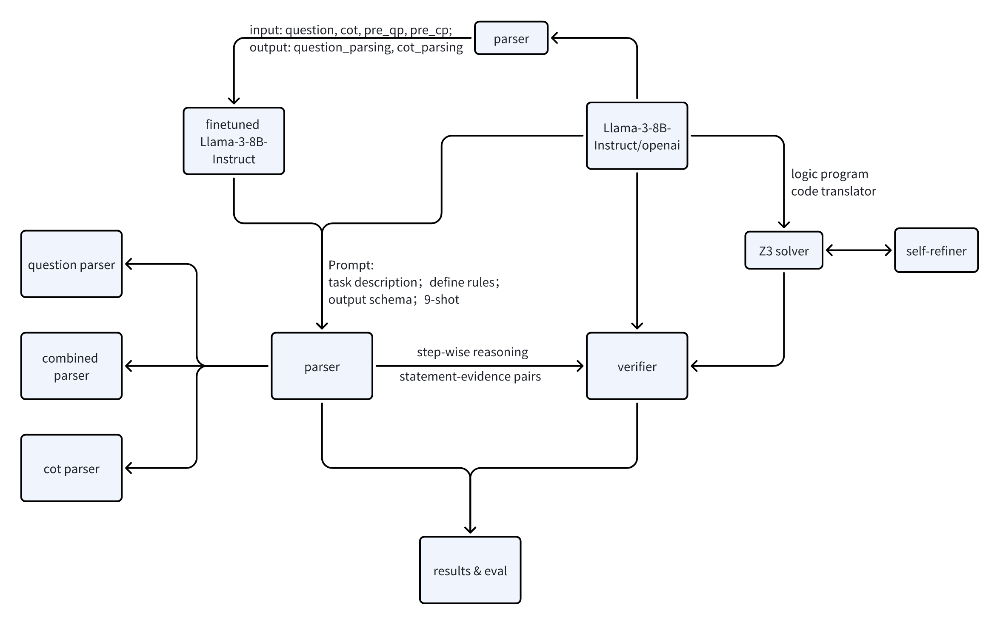

SRV: Empowering Self-Verification of Small Language Models through Step-wise Reasoning and Verification

## Abstract
Large language models (LLMs) have shown impressive reasoning capabilities through chain-of-thought. However, the reasoning processes remain inexplicable and uncontrollable. In this paper, we tackle the “LLM for Structural Reasoning” task at the XLLM Workshop of ACL 2025 by introducing a two-stage Parser–Verifier framework that decomposes generated reasoning into discrete inference steps and rigorously validates each one. First, our Parser extracts problem constraints and the sequence of reasoning steps from the LLM’s output. Then, our Verifier prompts itself or leverages a deterministic symbolic solver to formally check the logical correctness of every step. To ensure robust parsing, we also fine‑tune a compact model on a small, high‑quality annotation set produced by a more powerful LLM. Experiments on the LLMSR Reference_Test_A dataset demonstrate significant gains over baseline approaches, illustrating the effectiveness of our method for fine‑grained, step‑wise analysis of LLM chain-of-thought reasoning.

## Introduction
Large language models (LLMs) have achieved remarkable progress in natural language processing but still struggle with complex tasks demanding precise logical reasoning, particularly those involving multiple constraints, subproblems, or specialized knowledge. Although chain‑of‑thought (CoT) prompting can enhance inference capabilities, the generated reasoning chains are often unreliable, resulting in suboptimal downstream performance. Recent studies have shown that very large LLMs(OpenAI) can self‑correct their outputs through iterative refinement, inaugurating a new paradigm for mitigating erroneous generations. However, these models require vast parameter scales and extensive training data. \cite{}A recent pipeline generates self‑correction data from a small LM and fine‑tunes it into a self‑correcting reasoner, revealing that performance is largely bottlenecked by the verifier rather than the refiner, highlighting the need for robust self‑verification in compact models. Existing approaches, however, focus on validating entire CoTs without fine‑grained analysis of individual inference steps. In this paper, we propose a stronger self‑verification framework(cite figure) for small LMs(i.e. Llama‑3‑8B‑Instruct) using minimal data. We first prompt Llama‑3‑8B‑Instruct to produce CoTs for LogiQA questions, then conduct fine‑grained parsing of each question and each CoT reasoning step, followed by rigorous verification. For the parser module, we employ rule‑based prompting of the small LM and fine‑tuning using annotations generated by a LLM. For verifier, in addition to LLM‑based inference, we integrate a deterministic symbolic solver Z3 by translating the problem and reasoning steps into symbolic formulas and performing formal inference. Our method aims to deliver a fine‑grained, precise self‑verifier that improves the self‑correction and reasoning ability of small LMs and enables more granular process‑level reward modeling.

Framework:


## Problem Formulation of Self-Verification
We enhance the self-verification process by parsing and verifying the step-wise reasoning process.

**Step-wise Reasoning := Question Parser + CoT Parser**
We decompose step-wise reasoning parsing into two components: question parser and chain-of-thought(CoT) parser. A question typically comprises four parts: problem description, constraints, query, and options. The LLM is tasked with extracting all the conditions present in the first three parts. For each question, we instruct the LLM to generate the chain-of-thought that outlines the problem-solving process. From this chain-of-thought, we extract the statement and evidence for each reasoning step. Considering the nature of logical reasoning problems, the arguments mainly stem from the conditions given in the problem and may be related to the options; meanwhile, the evidence often consists of the problem conditions or intermediate conclusions. These two modules——question parser and CoT parser——can be integrated or processed separately, allowing for flexible adjustment of parameters to enhance parsing accuracy.

**Step-wise Verification := Verifier**
For the step-by-step reasoning in CoT, the verifier checks its correctness and marks it as True or False. A verifier, which can either be intrinsic (the LM itself) or extrinsic (an external signal), then decides whether the statement in the step is adequately supported by the corresponding evidence. If the verifier is unable to draw a conclusion, it defaults to considering the reasoning step as correct.

Decoupling parsers from verifier modules offers significant advantages over an "all-in-one" design. Firstly, we can freely parameterize each module, for instance, by using fine-tuning or few-shot prompting. Secondly, it reduces the difficulty of training each module since the model only needs to focus on one specific capability, either task-specific parsing or step-wise reasoning verification. Finally, it makes it possible to integrate deterministic verifiers that incorporate external symbolic solvers.


## Methodology

### Parser
Our method is divided into two stages: prompting a LM to generate question parsing and chain-of-thought (CoT) parsing, and then optionally using the obtained question parsing and CoT parsing together with the original question and CoT as input, with the target question parsing and CoT parsing as labels to supervise the fine-tuning of the LM.

- **Stage 1: Generating Question_Parsing and CoT_Parsing**
  We have set up three parsers: a question parser, a chain-of-thought parser, and a combined parser, which respectively parse the question, the CoT, and both simultaneously. This design allows us to adjust the parameters for each parser individually. The parsing process can flexibly choose any combination of these three parsers. In our prompt, we enforce corresponding rules that require the output of the parsing to remain as semantically consistent as possible with the original question/chain-of-thought. We also use one-shot examples to format the output structure and few-shot examples to enrich the diversity of logical question cases.
  For detailed prompt information, please refer to the appendix.

- **Stage 2: Supervised Fine-tuning of the Parser**
  To effectively fine-tune LM with minimal data, we supplement the original question and chain-of-thought with the question parsing and chain-of-thought parsing obtained from Stage 1 as input. This indicates the LM only need to learns how to refine the existing parsing results instead of having to learn parsing rules from scratch.
  For detailed prompt information, please refer to the appendix.

### Verifier
We employ two approaches for verifying the step-wise reasoning: one using LM inference, and the other aided by a deterministic symbolic solver.

#### LLM Verifier
For each reasoning step parsed into statements and evidence by the parser, we prompt the LLM, with original the question along with the statements and evidence, to directly verify whether a given statement can be deduced from the evidence. The correct conclusion is "true" and an incorrect deduction is "false". Below is the system prompt; for details on the user prompt could be seen in the appendix.

```python
LLM_VERIFT_SYSTEM_PROMPT = 'Whether the "statement" can be deduced from the "evidence" logically, answer with only with True or False, do not output other contents.'
```

#### Z3-Augmented Verifier
Inspired by Logic-LM (citation needed), we formulate the problem as corresponding symbolic solver expressions and use the symbolic solver to perform deterministic verification.

We define custom syntax rules as an intermediate representation between natural language and symbolic formulas. The LM is prompted to generate logical forms corresponding to the question and the step-wise reasoning, which are then translated into executable code that the symbolic solver can run to solve the problem, with the resulting output interpreted as "true" or "false".

The inputs for our model consist of a natural language logical reasoning question Q, along with step-wise reasoning R presented as pairs of statements and evidence. Our goal is to verify each statement-evidence pair. The Z3-Augmented Verifier follows the paradigm of Problem Formulation and Symbolic Reasoning to resolve the problem.

- **Problem Formulation**
  Given a natural language logical reasoning question Q and its step‐wise reasoning R, we prompt an LLM to translate them into self-defined intermediate representations. These are then converted into a formal, SMT-compatible representation by a code translator. This encoding captures both the question description and the step-wise reasoning in a symbolic language understandable by Z3.

- **Symbolic Reasoning**
  We invoke Z3 as a deterministic SMT solver over the encoded problem. Z3 efficiently checks the satisfiability, performs the required logical inferences, and produces a symbolic answer. Because Z3's algorithms are sound and complete for the supported theories, the correctness of the answer is guaranteed when the initial encoding is faithful.

- **Self-Refiner**
  For complex problems and intricate reasoning, it is challenging for the LM to generate correct logical expressions immediately. Therefore, we introduce a self-refinement module that returns syntax errors from the Z3 solver back to the LM, guiding it to generate a correct logical programs. This iterative refinement continues until a valid program is generated or the maximum number of attempts is reached.

- **Result Interpretation**
  Finally, we use a rule-based interpreter to map the symbolic output back into natural language, providing the final answer.

For the complete prompts of Problem Formulation, please refer to the appendix.


## Experimental Setup

### Datasets
We employe the dataset available at this Hugging Face repository https://huggingface.co/datasets/shuyi-zsy/LLMSR/blob/main/llmsr/(cite) to do our research. Examples could be seen in the appendix.


### Model Architecture and Fine-tuning

We use Llama-3-8B-Instruct as the base model for both the parser and the LM verifier. Considering Llama-3-8B-Instruct lacking in groundtruth of Z3 syntax, we employ o3-mini-high as the base model to generate Z3 expressions.

We set the temperature as 0.2~0.3 in the Question Parser, 0.5~0.6 in the Combined and Cot Parser. For Verification module, we set temperature as 0.1~0.2 in the Llama Verifier and the iteration of self-refinement as three.

We use the 24 samples in the datasets to fine-tune the base Llama-3-8B-Intruct with LoRA. We set the low-rank dimension as 32, the learning rate as 2e-5, training epochs as 6, batch size as 2. During inference, we set the temperature as 0 (i.e., greedy decoding) and the max sample length as 2,048. All our experiments can be conducted on 2×H20 GPU with 96GB of memory.


### Evaluation Metrics

- **Question_Macro_F1**
  We define Question_Macro_F1 as the macro‐averaged F1 score computed over the set of all atomic conditions that must be extracted from the input question. Each distinct condition constitutes its own class; true positives, false positives, and false negatives are counted per class, and then F1 is averaged uniformly across classes. This metric thus captures the model’s ability to recover every necessary constraint for downstream reasoning, regardless of class frequency.

- **Statement_Macro_F1**
  Statement_Macro_F1 denotes the macro‐averaged F1 score for segmenting and identifying individual reasoning statements and their associated evidence spans within the chain of thought. We treat each span type (statement vs. evidence) as a separate class and evaluate extraction quality via both lexical and semantic overlap against ground truth. Precision and recall are computed per class and averaged, ensuring balanced evaluation across all span categories.

- **Statement_Evidence_Macro_F1**
  Statement_Evidence_Macro_F1 measures the macro‐averaged F1 over pairwise links between extracted statements and their corresponding evidence. Each possible statement–evidence pairing is treated as a binary classification task (linked vs. unlinked). We compute class‐wise precision and recall for the “linked” label and average the resulting F1 scores across all statement–evidence candidates to assess the model’s ability to reconstruct the intended argumentative structure.

- **Reasoning_F1**
  Reasoning_F1 is the macro‐averaged F1 score for the final entailment verification between each correctly extracted statement–evidence pair. We frame logical deduction as a binary entailment decision (entails vs. does not entail). For all validated pairs, we compute precision and recall on the “entails” class and average the F1 scores uniformly, thereby evaluating end‐to‐end correctness of the tool‐augmented reasoning pipeline.


## Results and Conclusion
Table 1 presents the primary evaluation results for our base and fine-tuned models. The results include 4 performance metrics detailed in 4.x: Question_Macro_F1, Statement_Macro_F1, Statement_Evidence_Macro_F1 and Reasoning_F1. We have Four major findings.

| Approach | Question_F1 | Statement_F1 | Statement_Evidence_F1 | Reasoning_F1 |
|------|-------------|--------------|------------------------|--------------|
| Baseline | 0.5702 | 0.3341| 0.0852 | 0.0326 |
| Base Question Parser | 0.7192 | |  |  |
| Base Combined Parser | 0.7087 | 0.4247 | 0.168 |  |
| Fine-tuned Combined Parser(Preprocessed by Llama3) | 0.5078 | 0.3979 | 0.1417 | |
| Llama Verifier |  | | | 0.067 |
| O3-mini-high Verifier |  |  |  | 0.124 |
| Z3 Verifier(72%) |  | | | 0.078 |

### Main Findings

1)Temperature Settings for Question Parsing
We found that setting a relatively low temperature (around 0.2) for question parsing and subsequent reasoning yields more deterministic and robust outputs. A lower temperature helps reduce randomness during question generation, ensuring that the parsing results remain logically consistent and rigorous.

2)Balancing Temperature for Chain-of-Thought Parsing
For the chain-of-thought (CoT) parsing, it is crucial to strike a balance — the temperature should not be too low nor too high. A recommended range is between 0.5 and 0.6. If the temperature is too low, the generated content might be overly fixed and could miss out on important details or the richer process of reasoning. Conversely, if it is too high, the outputs can become too divergent, making it more difficult to extract relevant evidences and accurately perform subsequent verification. Thus, balanced temperature settings are essential to obtain both comprehensive and accurate reasoning chains.

3)Sample Requirements in Fine-tuning for Different Parsing Tasks

During fine-tuning, we observed that the chain-of-thought parsing can be effectively learned with only a few samples, as the model can grasp the basic reasoning structure and generate expected outputs. However, question parsing exhibited a significant performance drop when using few samples. This may be due to the higher demands of understanding and mapping the input text into precise logical representations—a more diverse dataset is required to capture the variability of questions. Therefore, increasing the number of samples is necessary to improve the accuracy and generalizability of question parsing.
<!-- 还需要再详细说一下strong LM和weak LM预处理的区别（但是o3的还没训练 -->

4)Impact of Z3 Solver on Verification Performance
In our experiments, the Z3 solver's success rate is around 72%, leading to a Reasoning_F1 score of 0.078. It is expected that if the parsing and logical expression generation achieved a 100% success rate, the Reasoning_F1 score could approach the reasoning performance demonstrated by the o3-mini-high model, around 85.07% better than the LM Verifier itself. This implies that the symbolic solvers could enhance the step-wise reasoning verification.


## References
@misc{zhang2024smalllanguagemodelsneed,
      title={Small Language Models Need Strong Verifiers to Self-Correct Reasoning}, 
      author={Yunxiang Zhang and Muhammad Khalifa and Lajanugen Logeswaran and Jaekyeom Kim and Moontae Lee and Honglak Lee and Lu Wang},
      year={2024},
      eprint={2404.17140},
      archivePrefix={arXiv},
      primaryClass={cs.CL},
      url={https://arxiv.org/abs/2404.17140}, 
}

@misc{paul2024refinerreasoningfeedbackintermediate,
      title={REFINER: Reasoning Feedback on Intermediate Representations}, 
      author={Debjit Paul and Mete Ismayilzada and Maxime Peyrard and Beatriz Borges and Antoine Bosselut and Robert West and Boi Faltings},
      year={2024},
      eprint={2304.01904},
      archivePrefix={arXiv},
      primaryClass={cs.CL},
      url={https://arxiv.org/abs/2304.01904}, 
}

@misc{pan2023logiclmempoweringlargelanguage,
      title={Logic-LM: Empowering Large Language Models with Symbolic Solvers for Faithful Logical Reasoning}, 
      author={Liangming Pan and Alon Albalak and Xinyi Wang and William Yang Wang},
      year={2023},
      eprint={2305.12295},
      archivePrefix={arXiv},
      primaryClass={cs.CL},
      url={https://arxiv.org/abs/2305.12295}, 
}